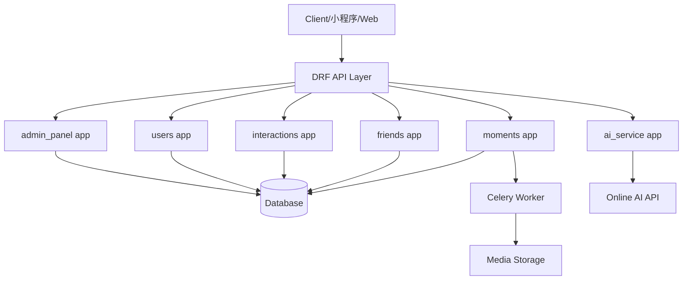

## MomentsShare 后端整体计划

### 1. 项目与基础配置

- 在根目录创建 Django 项目 `moments_share` 和以下应用：`users`、`moments`、`friends`、`interactions`、`ai_service`、`admin_panel`、`core`（放通用工具与配置）。
- 在 `settings.py` 中配置：`INSTALLED_APPS` (Django、DRF、SimpleJWT、各业务 app)、数据库、`REST_FRAMEWORK` 分页/认证、静态与媒体文件路径、时区/语言。
- 集成 `djangorestframework-simplejwt`：配置访问/刷新 Token、黑名单支持；URL 中挂载 `/api/v1/auth/` 相关路由基础设施。
- 配置 Celery（以 Redis 为 broker 的默认示例），在 `core` 中添加 `celery.py` 与任务自动发现；为本地开发提供简要 `requirements.txt` 与 `.env` 示例说明（如 AI 与 DB、Redis 地址）。

### 2. 用户账户模块 (`users`)

- **模型设计**：实现自定义用户模型 `User` 替代 Django 默认 User，字段严格按文档（phone 唯一、username 唯一、nickname、avatar、is_staff、is_active、created_at 等）。
- **认证与权限**：设置 `AUTH_USER_MODEL = 'users.User'`；实现基础权限类（如 `IsOwnerOrReadOnly`）和管理员权限检查（`IsAdminUser` 或自定义）。
- **序列化器**：实现注册用 `RegisterSerializer`、登录返回信息 `UserInfoSerializer`、当前用户信息序列化 `CurrentUserSerializer` 等。
- **视图与接口**：
  - `/api/v1/auth/register/`：校验手机号和用户名唯一性，创建用户，处理默认头像逻辑。
  - `/api/v1/auth/login/`：基于 SimpleJWT 的自定义视图，接收 `phone + password`，返回 `access`、`refresh` 和 `user_info`。
  - `/api/v1/auth/logout/`：接收 `refresh_token`，加入 SimpleJWT 黑名单。
  - `/api/v1/users/me/` (GET/PATCH)：获取和更新头像、用户名、昵称，PATCH 时校验用户名唯一性。
  - `/api/v1/users/me/phone/` (POST)：二次验证密码后修改手机号，校验新手机号是否被占用。
- **URL 路由**：在 `users/urls.py` 中定义上述接口路由，并在主路由 `moments_share/urls.py` 中以 `/api/v1/` 前缀包含。

### 3. 内容发布与管理模块 (`moments`)

- **模型设计**：
  - `Moment`：按需求添加 `author`、`content`、`type`（IMAGE/VIDEO）、`video_file`、`video_status`（PROCESSING/READY）、`is_deleted`、`created_at` 等。
  - `Image`：与 `Moment` 一对多，包含 `image_file` 与排序 `order`。
  - `Tag` 与 `Moment.tags` ManyToMany 关系（中间表 `MomentTag` 如需单独建模）。
- **敏感词过滤**：在 `core` 中实现 `sensitive_words.py` 工具与一个简单的敏感词加载机制（可来自配置或模型）；在发布动态前调用校验内容，如命中返回 400“包含敏感内容”。
- **序列化器**：
  - `MomentCreateSerializer`：处理 multipart/form-data，校验图片与视频互斥、图片数量 ≤9、处理标签创建/关联、触发敏感词检查。
  - `MomentDetailSerializer`：返回完整动态信息（作者基础信息、图片列表、视频链接、标签）。
  - 列表用轻量 `MomentListSerializer`（用于 Feed 与搜索）。
- **视图与接口**：
  - `/api/v1/moments/` (POST)：登录用户创建动态，若含视频则设置 `video_status=PROCESSING`，触发 Celery 异步转码任务，作者本人立即可见。
  - `/api/v1/moments/{id}/` (GET)：获取动态详情，屏蔽 `is_deleted=True` 内容；非作者访问时过滤 `VIDEO` 且 `video_status!=READY` 的帖子。
  - `/api/v1/moments/feed/` (GET)：基于好友关系（仅 ACCEPTED），排除 `is_deleted=True` 与视频未 READY 的帖子，按 `created_at` 倒序，全局分页。
  - `/api/v1/moments/search/` (GET)：支持 keyword 模糊、label 精确、时间范围筛选，并分页返回。
- **异步视频处理（Celery 任务）**：
  - 在 `moments/tasks.py` 中实现 `transcode_video(moment_id)`：模拟/封装视频转码（H.264），完成后更新 `video_status=READY`。
  - 在创建视频动态后调用 `transcode_video.delay(moment.id)`；在设置中配置定期任务的基础结构（如需要）。

### 4. 社交互动模块 (`friends`, `interactions`)

- **好友关系 (`friends` app)**：
  - 模型 `Friendship`：`from_user`、`to_user`、`status`（PENDING/ACCEPTED/REJECTED）、时间戳，`unique_together(from_user, to_user)`，删除为物理删除。
  - 序列化器：请求与响应使用简洁字段（用户 ID、状态）。
  - 视图与接口：
    - `/api/v1/friends/request/` (POST)：当前用户向 `to_user_id` 发起申请，创建 PENDING 记录。
    - `/api/v1/friends/respond/` (POST)：`request_id` + `action`（accept/reject）变更状态，校验只能被接收方操作。
    - `/api/v1/friends/{user_id}/` (DELETE)：删除当前用户与指定用户之间的好友关系（物理删除双向/单向记录，视设计选择并保证与 Feed 查询逻辑匹配）。
  - 在 `moments/feed` 查询中复用 `Friendship`，获取当前用户所有 ACCEPTED 好友 ID。
- **评论与回复 (`interactions` app)**：
  - 模型 `Comment`：关联 `Moment`、`author`、`content`、`parent`（自关联，支持楼中楼）、`created_at`、`is_deleted`。
  - 序列化器 `CommentSerializer`：支持嵌套回复树结构（通过递归或分两次查询组装），屏蔽已软删除记录。
  - 视图与接口：
    - `/api/v1/moments/{id}/comments/` (POST)：创建一级评论或带 `parent_id` 的回复，校验父评论属于同一 Moment。
    - `/api/v1/moments/{id}/comments/` (GET)：获取该动态下的评论树，按时间排序，支持分页或分层返回策略。

### 5. Moment Copilot 模块 (`ai_service`)

- **封装 AI 客户端**：在 `ai_service/client.py` 中抽象一个 `AIClient`，内部使用可配置的在线大模型 API（如调用 HTTP 接口，读取 `AI_API_KEY` 等环境变量）。
- **业务逻辑**：
  - 图像处理入口预留（例如只上传 URL 或简单二进制传递给模型，实际实现中可仅将“收到图片”作为提示文本一部分）。
  - 在无可用真实模型或配置缺失时，需优雅降级（返回基于规则的简单结果并记录日志）。
- **视图与接口**：
  - `/api/v1/ai/polish/` (POST)：接收 `text` 和/或 `image`，调用 `AIClient` 生成润色文案，返回 `generated_text`。
  - `/api/v1/ai/recommend-tags/` (POST)：基于 `text` 和/或 `image` 调用 `AIClient`，得到候选标签列表，裁剪为 3–5 个且单标签长度 ≤10，返回 `tags`。
- **序列化器与校验**：实现输入参数校验（至少有 text 或 image 之一），输出字段格式化。

### 6. 管理后台 API 模块 (`admin_panel`)

- **权限控制**：实现 `IsStaffUser` 权限类，仅允许 `is_staff` 或 `is_superuser` 用户访问 `/api/v1/admin/*` 接口。
- **管理员登录**：
  - `/api/v1/admin/auth/login/`：基于 SimpleJWT 自定义视图，仅允许 `is_staff` 用户通过；普通用户登录尝试返回 403。
- **内容审计**：
  - `/api/v1/admin/contents/` (GET)：分页返回全站内容列表（含用户信息、是否被软删除、视频状态等），支持 `user_id` 过滤。
  - `/api/v1/admin/contents/{id}/` (DELETE)：将对应 `Moment.is_deleted` 置为 True，前台查询统一过滤该字段。
- **运营数据看板**：
  - `/api/v1/admin/stats/` (GET)：计算并返回当日 DAU、每日新增注册、每日发帖量。
  - 在 `core` 中抽象统计服务：
    - DAU：基于当日有请求记录或 JWT 刷新记录的用户数（可用简单版本：当日有发帖/评论/登录记录的用户）。
    - 新注册数：按 `User.created_at` 当日计数。
    - 发帖量：按 `Moment.created_at` 当日计数。

### 7. 全局配置、分页与路由

- **分页**：在 `settings.REST_FRAMEWORK` 中配置全局分页类（如 `PageNumberPagination`），默认 page & page_size，并在需要时允许前端覆盖；所有列表接口使用该分页机制，满足 C-02 要求。
- **全局异常处理**：在 `core/exceptions.py` 中定义统一异常格式（如敏感词错误、权限错误等），在 `REST_FRAMEWORK` 中配置 `EXCEPTION_HANDLER` 实现统一返回结构。
- **主路由**：
  - 在 `moments_share/urls.py` 中注册 `/api/v1/` 前缀下各 app 的 `urls.py`；配置媒体文件访问路由（仅开发环境）。
  - 预留 `/admin/` Django 原生后台（仅内部调试用），不对产品功能文档暴露。

### 8. 简要架构示意

### 9. 实现顺序建议

- 先完成项目骨架与 `users` 模块（注册、登录、JWT、当前用户、手机号修改、退出）。
- 再实现 `moments`（模型、发布、Feed、搜索、敏感词过滤、视频处理任务）。
- 接着完成 `friends` 与 `interactions`（好友关系、评论与楼中楼）。
- 然后实现 `ai_service` 与外部 AI 客户端封装，打通图文润色和标签推荐。
- 最后完成 `admin_panel` 管理接口与运营数据统计，并整体联调、补充关键注释与文档。